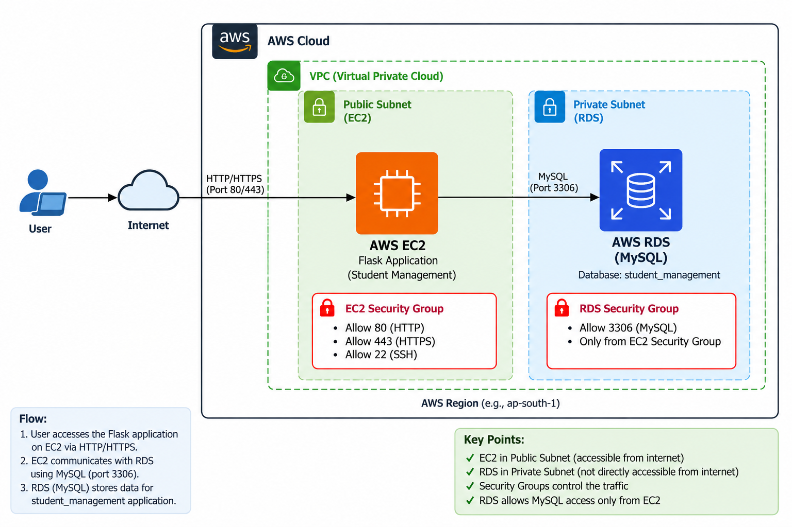
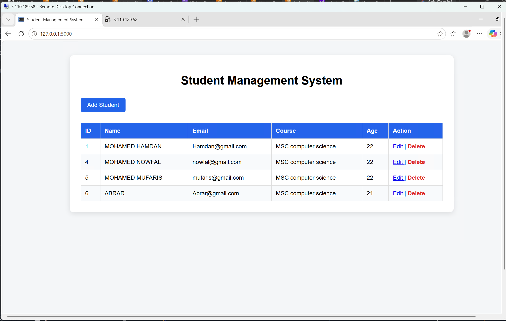
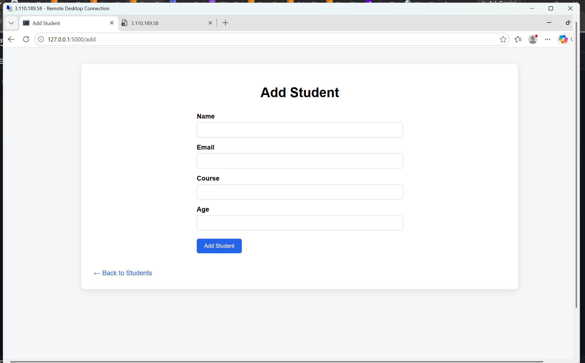
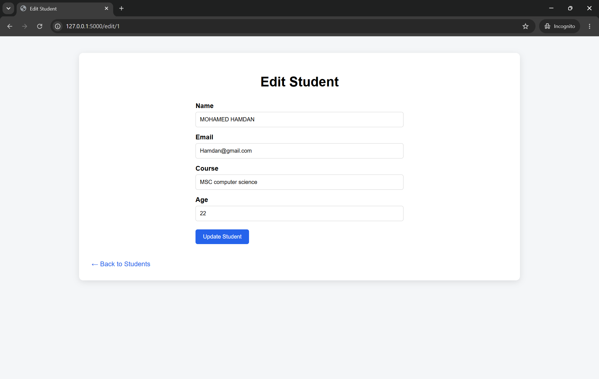
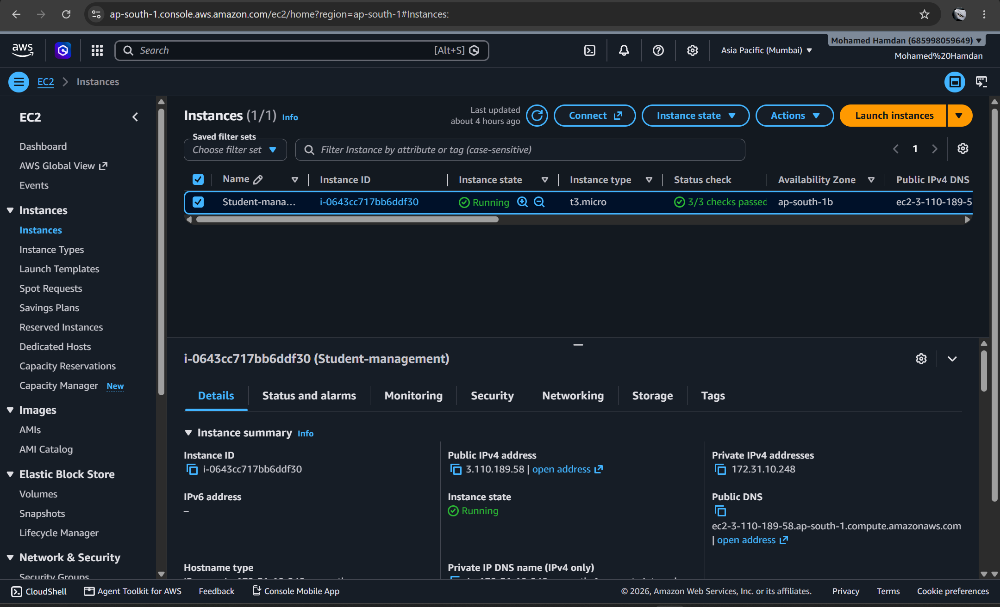
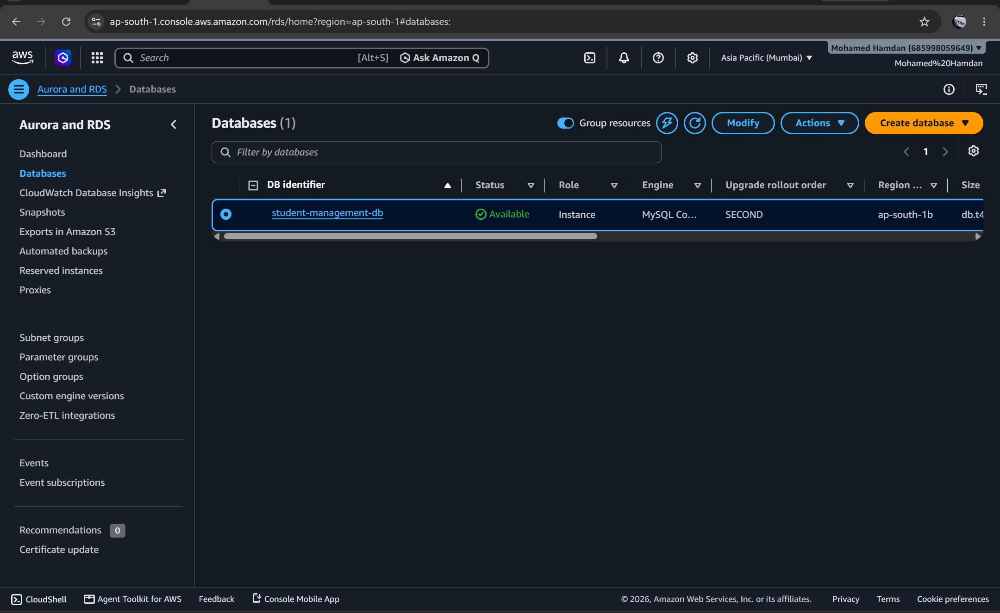
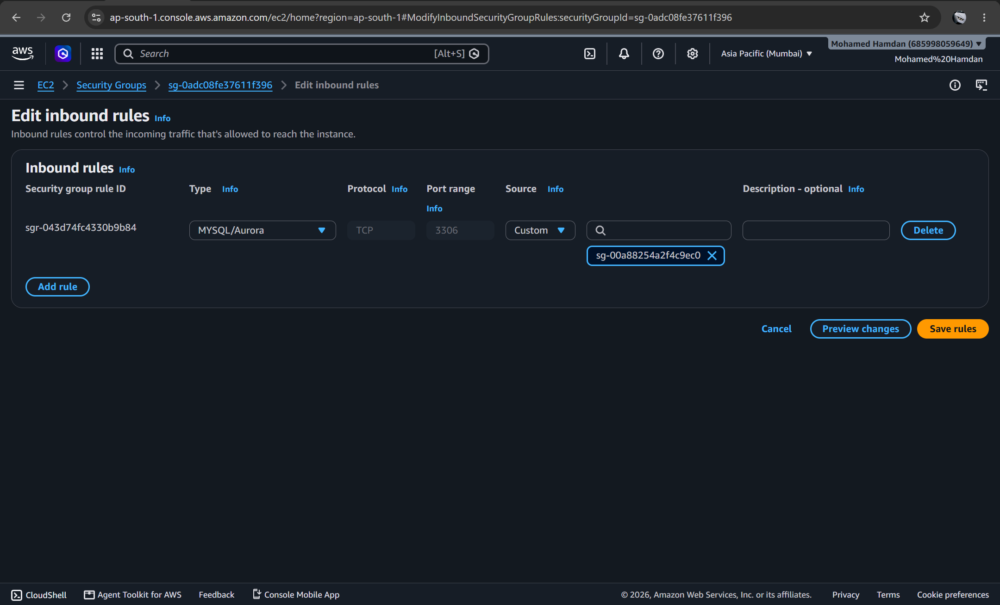

# 🎓 Student Management System

A web-based **Student Management System** built using **Python Flask** and **MySQL**, deployed on **AWS EC2** with **Amazon RDS (MySQL)** as the database.

The application allows users to manage student records using basic CRUD operations such as **Add, View, Edit, and Delete**.

---

## 🚀 Project Overview

This project demonstrates how to deploy a Flask web application on AWS and connect it securely to an Amazon RDS MySQL database.

### Architecture

### Application Flow

1. User accesses the Flask application through the internet.
2. The Flask application runs on an **AWS EC2 instance**.
3. EC2 connects to **Amazon RDS MySQL** using port `3306`.
4. RDS stores the student information in the `student_management` database.
5. Security Groups control communication between EC2 and RDS.

---

## 🛠️ Technologies Used

### Application
- Python
- Flask
- HTML
- CSS
- MySQL Connector

### AWS Services
- Amazon EC2
- Amazon RDS for MySQL
- Amazon VPC
- Security Groups

### Database
- MySQL
- Database: `student_management`

---

## ✨ Features

- 📋 View all students
- ➕ Add new students
- ✏️ Edit student information
- 🗑️ Delete student records
- 🗄️ Store student data in MySQL
- ☁️ Deploy Flask application on AWS EC2
- 🔐 Secure EC2-to-RDS database communication

---

## 📸 Application Screenshots

### 🏠 Home Page

The home page displays the list of students stored in the database.

---

### ➕ Add Student

Users can add a new student by entering their name, email, course, and age.

---

### ✏️ Edit Student

Users can update existing student information.

---

## ☁️ AWS Deployment

### 🖥️ EC2 Instance

The Flask application is deployed and running on an AWS EC2 instance.

---

### 🗄️ Amazon RDS

Amazon RDS is used as the MySQL database for storing student records.

---

### 🔐 RDS Security Group

The RDS Security Group allows MySQL traffic on port `3306` only from the EC2 Security Group.

---

🧪 Testing

The application was tested for:

✅ Adding student records
✅ Displaying student records
✅ Editing student records
✅ Deleting student records
✅ EC2 application connectivity
✅ EC2-to-RDS connectivity
✅ MySQL database operations
✅ RDS Security Group configuration

---

📌 Project Highlights

* Built a complete Flask CRUD web application.
* Deployed the application on AWS EC2.
* Used Amazon RDS MySQL as the backend database.
* Configured EC2 and RDS Security Groups.
* Implemented secure EC2-to-RDS communication.
* Practiced AWS cloud deployment and networking concepts.

⭐ Conclusion

* This project demonstrates a basic cloud-based Student Management System using Flask, MySQL, Amazon EC2, and Amazon RDS.
* It provides practical experience with AWS deployment, VPC networking, Security Groups, database connectivity, and web application development.